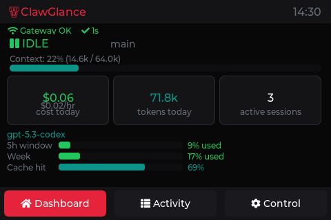
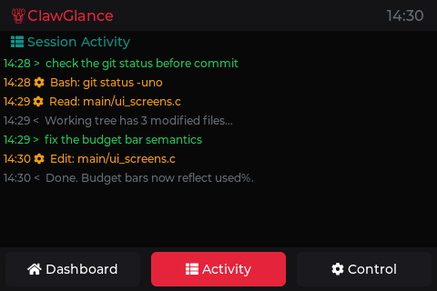
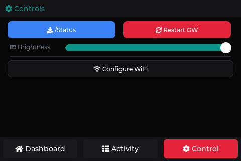

# ClawGlance

A physical mission control dashboard for [OpenClaw](https://openclaw.ai) agents, built on an ESP32-S3 with a 3.5" touchscreen display.

Turn your autonomous AI agent from a "black box running in the background" into something you can trust, monitor, and safely operate in real time.

## Screens

<p align="center">
  
  
  
</p>

Screenshots rendered by the [headless PC simulator](sim/) against the actual `main/ui_screens.c` — same LVGL code path the device runs. Regenerate after UI changes with `cd sim && make`.

## What It Does

**Dashboard** — glanceable status at arm's length:
- Agent status (IDLE / ACTIVE / ERROR) with session name and duration
- Context usage bar with percentage and token counts
- Three KPI cards: cost today (with burn rate), tokens consumed, active sessions
- Model name and OpenAI usage budget bars (5h window + weekly)
- Cache hit rate bar
- Gateway health indicator with heartbeat age
- Color-coded alerts when thresholds are crossed

**Activity Feed** — real-time agent transcript:
- Parsed from OpenClaw session JSONL files
- Shows user messages, tool calls, and agent replies
- Color-coded: green (user), amber (tools), grey (replies)
- Last 10 events, auto-updates every 5 seconds

**Control Screen** — manage your setup:
- Refresh Status / Restart Gateway buttons
- Screen brightness slider (persists across reboots)
- WiFi SSID and password configuration
- Gateway host:port configuration
- On-screen keyboard for text input
- Save & Reboot to apply changes

**About Screen** — swipe right from dashboard:
- OpenClaw lobster logo, versions, system info
- Swipe navigation between all screens

## Supported Hardware

ClawGlance runs on multiple ESP32 display boards from a single codebase. Pick one:

| Board | Display | Resolution | Touch | PIO Env |
|-------|---------|-----------|-------|---------|
| **ESP32-S3 3.5"** | ST7796S | 480x320 | Capacitive | `s3-35-st7796s` |
| **CYD 2.8" (ILI9341)** | ILI9341 | 320x240 | Resistive (XPT2046) | `cyd-28-ili9341` |
| **CYD 2.8" (ST7789)** | ST7789 | 320x240 | Resistive (XPT2046) | `cyd-28-st7789` |
| **CYD 3.5"** | ST7796U | 480x320 | Resistive (XPT2046) | `cyd-35-st7796u` |

- **CYD** = "Cheap Yellow Display" (ESP32-2432S028R for 2.8", ESP32-2432S035 for 3.5")
- The 2.8" CYD ships with either ILI9341 or ST7789 depending on the batch — check the IC marking on your board
- No soldering required on any board. Just USB-C for power and flashing.

## Architecture

```
┌─────────────┐     HTTP/5s       ┌─────────────────────────────────┐
│   ESP32-S3  │ ◄───────────────► │        OpenClaw Gateway         │
│  (display)  │    port 18789     │  ┌───────────────────────────┐  │
│             │                   │  │  clawglance plugin        │  │
│             │  /api/clawglance/ │  │    /api/clawglance/*      │  │
│             │                   │  │  (runs in-process: reads  │  │
│             │ ─── /health ────► │  │   session JSONL, tails    │  │
│             │                   │  │   logs, polls CLI every   │  │
│             │                   │  │   3s)                     │  │
└─────────────┘                   │  └───────────────────────────┘  │
                                  └─────────────────────────────────┘
```

- **plugin-clawglance** is a TypeScript gateway plugin that runs inside the OpenClaw gateway process. It polls session files, `openclaw status --json`, `openclaw gateway usage-cost`, and tails gateway/runtime logs every 3 seconds, then serves the result at `/api/clawglance/*` on the gateway's own port.
- **ESP32** polls the plugin over HTTP every 5 seconds and runs a `/health` check directly against the gateway every 30 seconds.
- **Zero token cost** for monitoring — all data comes from local files and CLI output, not LLM calls.
- WiFi and gateway settings are configurable on-device and persist in NVS flash.

## Quick Start

### 1. Install PlatformIO

```bash
pip install platformio
# or
brew install platformio
```

### 2. Configure

Edit `main/config.h` with your defaults, or configure on-device after first flash:

```c
#define CG_WIFI_SSID  "YOUR_WIFI_SSID"
#define CG_WIFI_PASS  "YOUR_WIFI_PASSWORD"
#define CG_OC_HOST    "192.168.1.100"  // your OpenClaw host LAN IP
#define CG_OC_TOKEN   "YOUR_GATEWAY_TOKEN"
```

### 3. Flash

Pick the PIO env that matches your board (see table above):

```bash
pio run -e cyd-28-ili9341 -t upload    # CYD 2.8" ILI9341
pio run -e cyd-28-st7789 -t upload     # CYD 2.8" ST7789
pio run -e cyd-35-st7796u -t upload    # CYD 3.5"
pio run -e s3-35-st7796s -t upload     # ESP32-S3 3.5"
```

If the USB port isn't auto-detected:
```bash
pio run -e cyd-28-ili9341 -t upload --upload-port /dev/cu.usbserialXXXXX
```

**First boot (CYD boards only):** A touch calibration screen appears. Tap the red crosshair (top-left), then the blue crosshair (bottom-right). Calibration is saved to flash and doesn't repeat unless you erase NVS:

```bash
python3 tools/erase_nvs.py
```

### 4. Install the ClawGlance Plugin

On the machine running OpenClaw, drop `plugin-clawglance/` into the OpenClaw extensions directory as `clawglance`, then restart the gateway so it picks up the new plugin:

```bash
# One-time install (copy):
cp -r plugin-clawglance ~/.openclaw/extensions/clawglance

# Or for development — symlink so source edits reload on gateway restart:
ln -s "$(pwd)/plugin-clawglance" ~/.openclaw/extensions/clawglance

# Restart the gateway:
openclaw gateway restart
```

Once loaded, the plugin exposes REST endpoints on the gateway's own port (default `18789`, Bearer-auth with your gateway token):

- `/api/clawglance/telemetry` — model, context, tokens, cache, budget
- `/api/clawglance/costs` — daily cost and token count
- `/api/clawglance/sessions` — session list with status
- `/api/clawglance/transcript` — recent agent transcript from session JSONL
- `/api/clawglance/activity` — gateway log events
- `/api/clawglance/system` — version, model, session counts
- `/api/clawglance/chat` — POST a message into the active session (used by the Send screen)

Note that the plugin requires OpenClaw gateway `>= 2026.3.24-beta.2` (the plugin API version is pinned in `plugin-clawglance/openclaw.plugin.json`).

### 5. Configure OpenClaw Gateway

The gateway must be accessible from your LAN:

```bash
openclaw config set gateway.bind lan
```

## Project Structure

```
clawglance/
├── main/
│   ├── main.c              # Entry point, polling loop, boot sequence
│   ├── config.h            # WiFi, gateway, display, board selection
│   ├── app_state.h         # Data structures (telemetry, sessions, etc.)
│   ├── ui_screens.c        # LVGL UI — all 4 screens + board-conditional layout
│   ├── ui_screens.h        # Public UI API
│   ├── wifi_mgr.c/h        # ESP-IDF WiFi with auto-reconnect
│   ├── oc_client.c/h       # HTTP client for the gateway plugin
│   ├── lobster_icon.c      # Custom LVGL font — lobster emoji (16px)
│   ├── lobster_icon_lg.c   # Large lobster emoji (48px) for about screen
│   └── Kconfig.projbuild   # Board selection + LVGL task priority config
├── components/
│   ├── lvgl/               # LVGL 8.3 source
│   ├── lv_port/            # Display + touch driver — S3 (pre-compiled .a)
│   ├── lcd_bsp/            # Board support — S3 (pre-compiled .a)
│   ├── cyd_bsp/            # CYD board support (ILI9341/ST7789/ST7796U + XPT2046)
│   │   ├── cyd_lcd.c/h     #   SPI display driver with per-board init sequences
│   │   ├── cyd_touch.c/h   #   XPT2046 touch + NVS calibration + pixel font
│   │   ├── cyd_lvgl.c      #   LVGL wiring (display + touch + tick + handler)
│   │   ├── cyd_bsp.c       #   Board init (backlight, GPIO)
│   │   └── cyd_pins.h      #   Pin map (conditional on board variant)
│   └── pwm/                # PWM driver
├── plugin-clawglance/      # OpenClaw gateway plugin (TypeScript)
│   ├── index.ts            # Polling + HTTP routes (runs in-process)
│   ├── openclaw.plugin.json
│   └── package.json
├── tools/
│   └── erase_nvs.py        # Utility to erase NVS (forces touch recalibration)
├── platformio.ini          # PlatformIO build config (4 board envs)
├── CMakeLists.txt          # ESP-IDF CMake config
├── partitions.csv          # Flash partition table (S3, 8MB)
├── cyd_partitions.csv      # Flash partition table (CYD boards, 4MB)
├── sdkconfig.defaults      # ESP-IDF Kconfig defaults (S3)
├── sdkconfig.cyd.defaults  # ESP-IDF Kconfig defaults (CYD 2.8" ILI9341)
├── sdkconfig.cyd-st7789.defaults  # (CYD 2.8" ST7789)
└── sdkconfig.cyd35.defaults       # (CYD 3.5" ST7796U)
```

## Key Technical Details

- **Multi-board from one codebase**: Board selection via Kconfig (`CONFIG_CG_BOARD_*`), pinned in each `sdkconfig.*.defaults`. The S3 board uses pre-compiled BSP libraries (`.a` files); CYD boards use `components/cyd_bsp/` with ILI9341/ST7789/ST7796U + XPT2046 drivers built from source.
- **Internal RAM contention**: The display DMA and WiFi both need internal (non-PSRAM) RAM. WiFi is initialized with reduced buffers (`static_rx=4, dynamic_rx=8, dynamic TX mode`) to coexist with the display driver.
- **ESP-IDF 5.3.x required**: PlatformIO is pinned to `espressif32@6.8.1` which bundles 5.3.0.
- **LVGL thread safety**: All LVGL updates use `lv_port_sem_take/give` semaphores. The main polling loop runs on `app_main`'s stack (large enough for HTTP+JSON).
- **NVS persistence**: WiFi credentials, gateway config, brightness, and touch calibration are stored in NVS flash and loaded on boot.
- **Touch calibration**: CYD boards run a 2-point crosshair calibration on first boot. Calibration data is saved to NVS and loaded automatically on subsequent boots. Erase with `python3 tools/erase_nvs.py` to recalibrate.

## Screens

| Screen | Access | Description |
|--------|--------|-------------|
| **Dashboard** | Default / swipe | Mission control with health, KPIs, context, budget |
| **Activity** | Tab / swipe left | Session transcript feed (user msgs, tool calls, replies) |
| **Control** | Tab / swipe left | Buttons, brightness, WiFi/gateway config |
| **About** | Swipe right from dash | Version info, system details, credits |

## License

[MIT](LICENSE) © 2026 David Low

## Credits

Built with [Claude Code](https://claude.ai/claude-code) on the [OpenClaw](https://openclaw.ai) platform.
